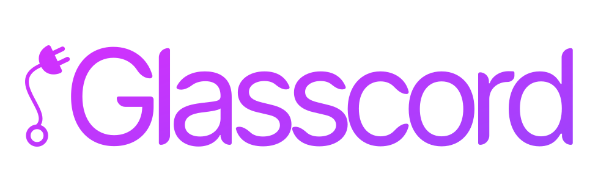
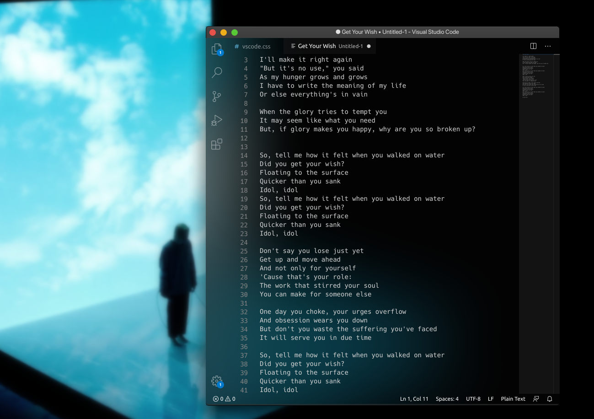

# 
Providing composition effects to Electron applications.


[](https://ko-fi.com/K3K3D0E0)
[](https://patreon.com/arytonex)
[](https://www.paypal.com/cgi-bin/webscr?cmd=_s-xclick&hosted_button_id=Y7ZAFZ2H56FD4)
[](https://discord.gg/SftnByN)




### What is it?
Glasscord is a really simple tool based on [Glasstron](https://github.com/AryToNeX/Glasstron)
that enables window composition effects (transparency and frosted glass effects) on Electron apps,
such as Discord and Visual Studio Code; however it can work with *almost any* Electron app.

It is compatible with Windows, Linux and macOS.

More functionalities are achievable by extending Glasscord with modules.
You can find more on [the Glasscord-Modules repo](https://github.com/AryToNeX/Glasscord-Modules).

### So, is it a theme?
Glasscord is NOT a theme. It's a tool that enables themes to request composition effects.

To put it in other, more simple words, you will need a theme that uses Glasscord's "CSS API" to be able to see it in action.

### But why?
I was bored and I made an early proof of concept to post on [r/unixporn](https://www.reddit.com/r/unixporn/comments/fu0bqh/kde_stop_blurry_discord/).
It seemed that a few people liked the idea, so I made that into an actual tool for themers.

_TL;DR: Help me I have no purpose in this life anymore_

## Is it secure to use it?

It is not. If you want your app to be 100% safe, you should not modify it in the first place.
That said, this modification disables some of Electron's security restrictions to be able to work as intended.

I am fully committed in reducing the amount of stuff Glasscord disables or "hacks around" to work properly, but
it's a considerable effort to do so, and in some way it's not really possible to do it 100% of the times.

Legally speaking, modifying apps which work mostly offline (like Visual Studio Code) should be safe;
however, modifying apps tied with online services (like Discord) might go against their Terms of Service.

Neither I nor my contributors assume any kind of responsibility if your online accounts get shut down because you used this modification.
You are and will always be on your own if you inject stuff on applications!

## How do I install it?
Well, glad you asked! You can find a tutorial [here](https://github.com/AryToNeX/Glasscord/wiki/Installation)!

## How do I USE it?
Assuming you already installed everything correctly, you will need to load a custom CSS theme which supports Glasscord.

If you're using a third-party CSS loader, please refer to your CSS loader documentation to know how to load CSS stylesheets.

If you're using Glasscord's own CSS loader, you can configure it easily by editing the configuration files in:
- Windows: `%appdata%/glasscord`;
- Linux: `~/.config/glasscord`; this may vary if you installed Glasscord on a Snap/Flatpak package.
- macOS: `~/Library/Application Support/glasscord`.

## Is it compatible with _[name of random Electron app here]_?
Try it for yourself and let us know!

## Hey buddy, I am a theme creator; how should I support Glasscord in my own themes?
Glasscord will look for some CSS properties defined in the `:root` CSS selector.
Please take a look at the `discord_example.theme.css` file to better understand how they are used.

Want to take a look at all the currently supported CSS properties? You can do so [here](https://github.com/AryToNeX/Glasscord/wiki/CSS-Properties).

## I want to contribute to this madness!
Did you find a bug? File it in the issues section!
Do you know how to fix stuff? Make a pull request!
Or perhaps you want to send me a hug and a coffee? You can do so [here](https://ko-fi.com/arytonex)!

## License

### Glasscord is licensed under the Apache 2.0 License

```
Copyright 2020 AryToNeX

Licensed under the Apache License, Version 2.0 (the "License");
you may not use this file except in compliance with the License.
You may obtain a copy of the License at

	http://www.apache.org/licenses/LICENSE-2.0

Unless required by applicable law or agreed to in writing, software
distributed under the License is distributed on an "AS IS" BASIS,
WITHOUT WARRANTIES OR CONDITIONS OF ANY KIND, either express or implied.
See the License for the specific language governing permissions and
limitations under the License.
```
